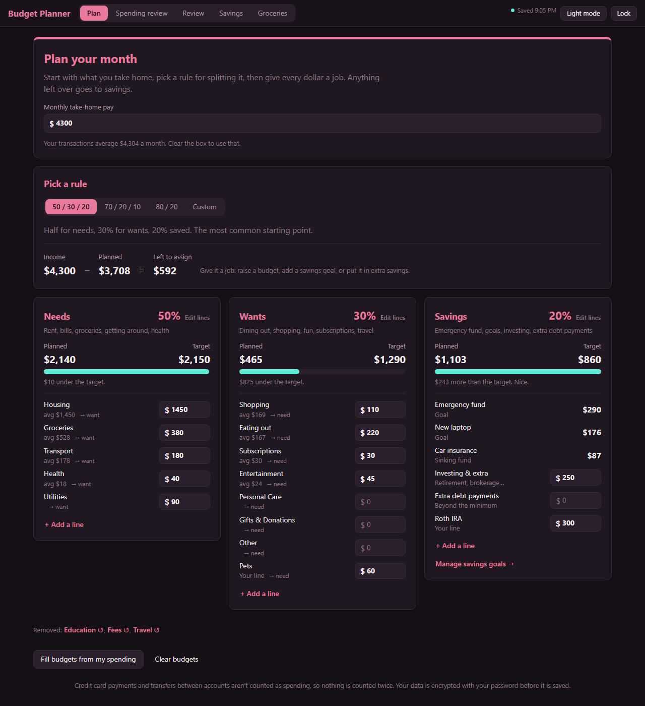
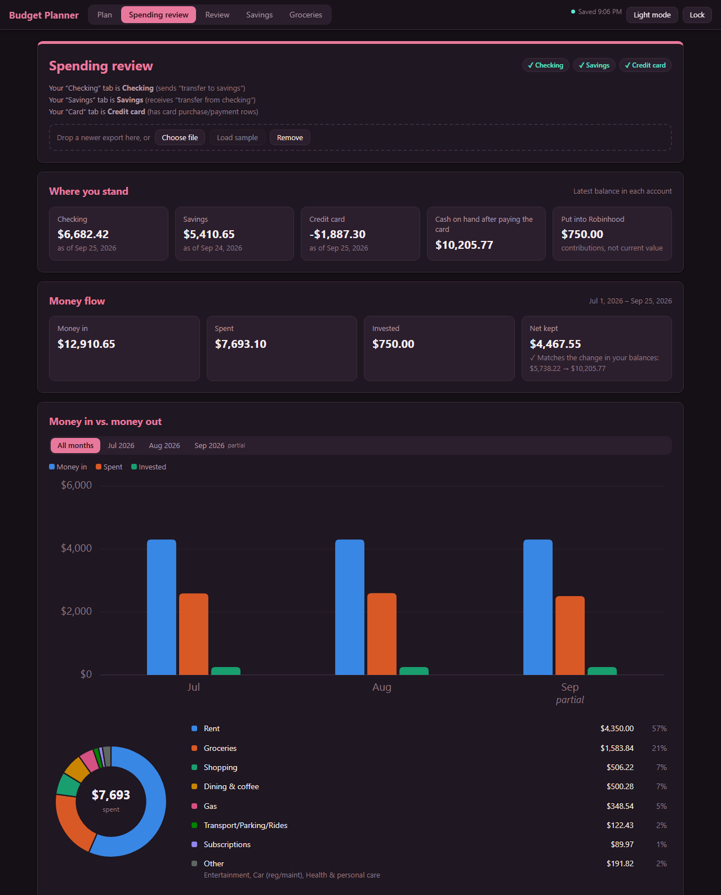
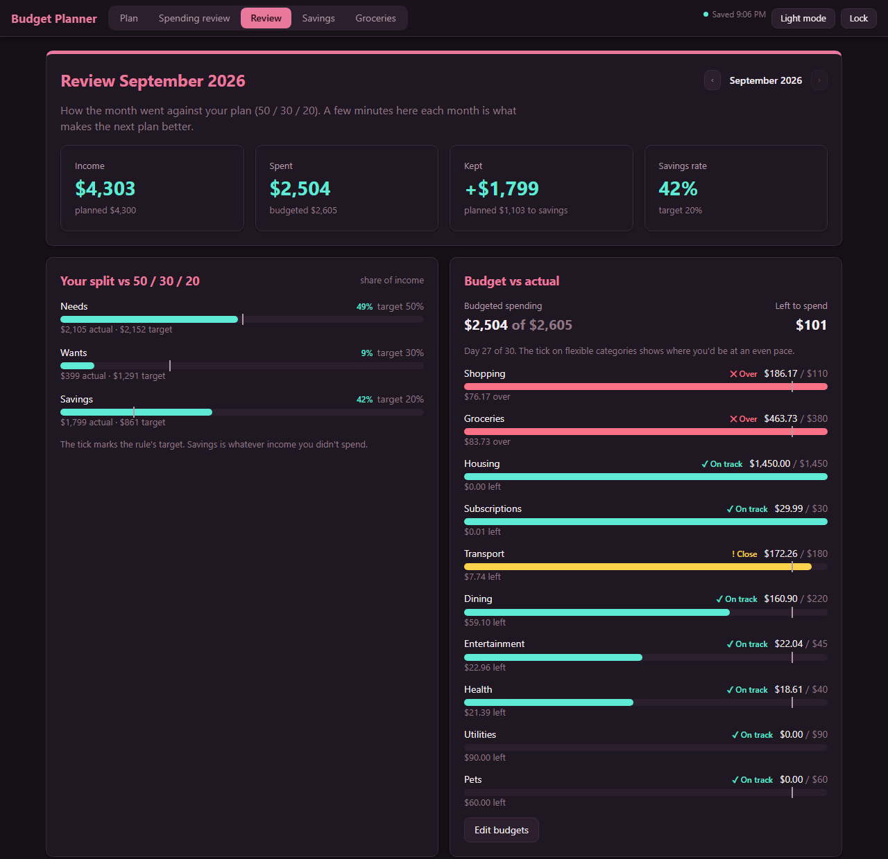
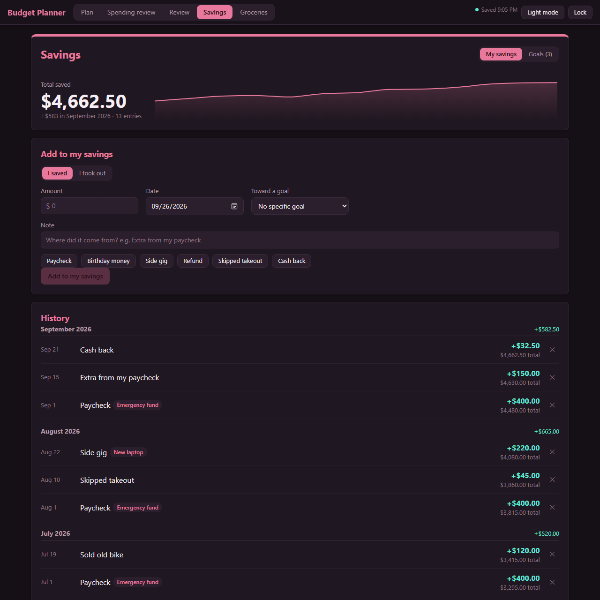
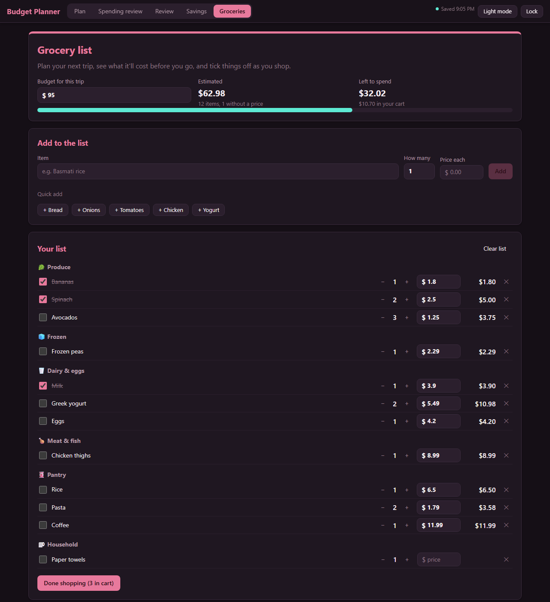
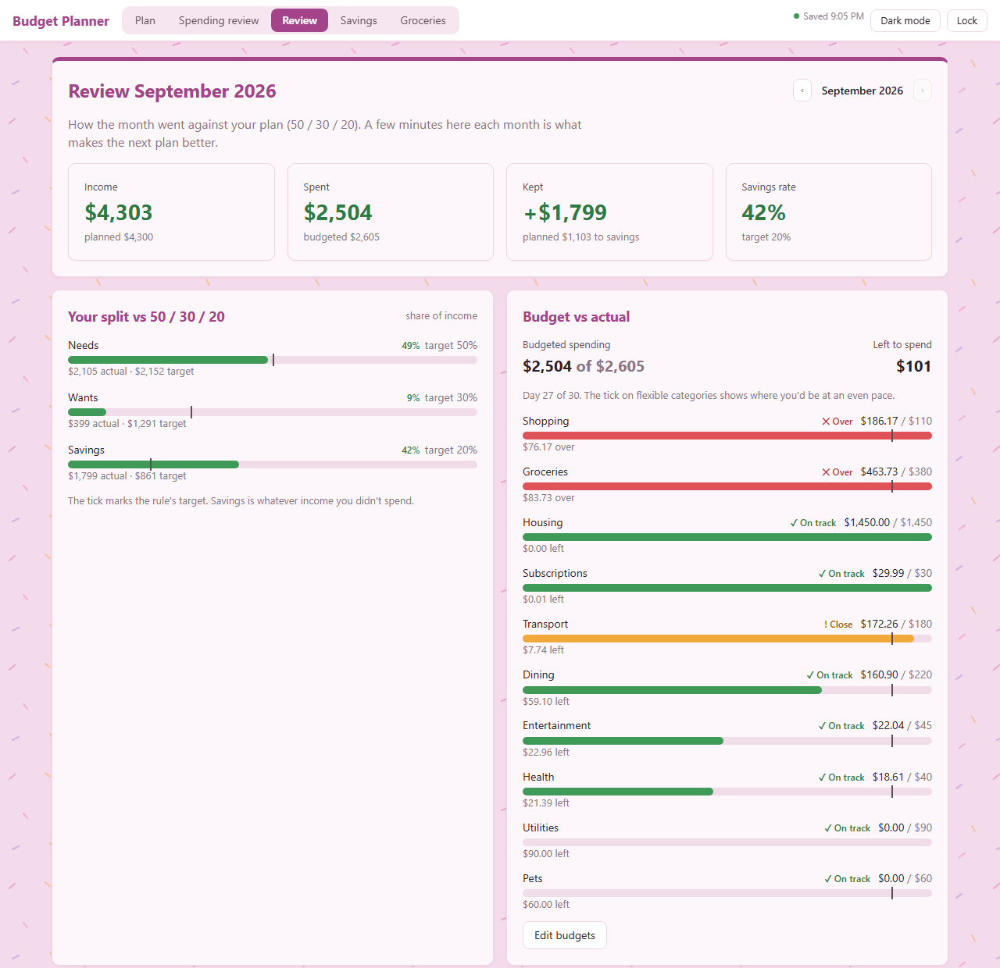
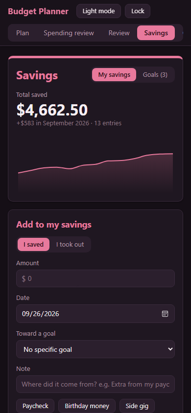

# Budget Planner

A personal budgeting app I built for myself. Plan the month, see where the money actually went from a bank export, log what I save, and plan grocery trips. Everything is encrypted in the browser under a password and synced across my laptop and phone. There are no accounts, no third-party services and no tracking.

**Stack:** React 19 · TypeScript · Vite · Recharts · Web Crypto API · Vitest

> The source code is kept private because it's tuned to my own bank data. This page is an overview of what the app does and how it works. All screenshots use made-up data.

## Features

### Plan
- Enter take-home pay and pick a rule for splitting it: **50/30/20**, **70/20/10**, **80/20**, or a custom split.
- Every category sits in a Needs, Wants or Savings bucket, with a meter showing planned vs. target.
- Lines are fully editable. You can **rename**, **remove**, **add your own** and move categories between needs and wants.
- "Every dollar has a job": the app shows what's left to assign, or how far over you've planned.
- Budgets can be filled automatically from your average spending.

### Spending review
- Drop in the bank's **Excel export** (checking, savings and credit card sheets).
- Each transaction is classified by ordered matching rules. Transfers between your own accounts and credit card payments are filtered out so nothing is counted twice.
- **Balance reconciliation** checks each account's opening and closing balance against its transactions.
- A category donut, spending by month, suggested budget caps, and a drill-down to every transaction behind a number.
- Re-categorize any transaction by hand and the choice sticks.

### Review
- Month-by-month planned vs. actual for each bucket.
- Budgets that ran over, spending on pace to run over, and insights.
- Notes for each month on what went well and what to change.

### Savings
- A **savings log**: each time money is put aside or taken out, add a note and see the new total ("Nice! $150 saved. Your savings are now $3,420").
- A balance-over-time chart and a history grouped by month.
- **Goals and sinking funds** with target dates; the monthly amount needed is worked out automatically.

### Groceries
- A shopping list with a trip budget, grouped by aisle.
- Remembers the prices you've entered before, so repeat items fill in automatically.
- Running total vs. budget as items go into the cart, plus a log of past trips.

### Light mode and phone

Light and dark themes are included, and the layout works on a phone.

  
  &nbsp;
  

## How the data is protected

- The app works from the browser's local storage. Every change is **encrypted in the browser** with **AES-GCM**, using a key derived from the password with **PBKDF2-SHA-256 (600,000 iterations)**.
- A small server endpoint (a Vite middleware plugin) stores only the encrypted blob. It never sees the password or any unencrypted data.
- **Multi-device sync:** each save carries a version number. If another device saved first, the server rejects the save, and the two sets of changes are merged key by key before saving again.
- **"Keep me unlocked"** stores the key in IndexedDB as a *non-extractable* `CryptoKey`: the browser can use it, but nothing can read it out.
- **Lock** saves, then wipes the local copy from that browser.
- Access from a phone goes over a private Tailscale network with HTTPS.

## Engineering notes

- Transactions are processed in a pipeline: parse → normalize → classify → reconcile → aggregate. All money is handled in integer cents to avoid floating-point drift.
- Unit tests cover the classifier, the reconciliation and the vault (encryption round trip, wrong-password rejection, three-way merge). Acceptance tests check totals against a real statement export, which is kept out of version control.
- Linted with oxlint and type-checked with TypeScript 6.
